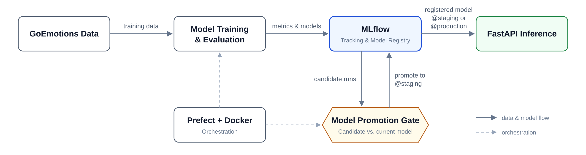
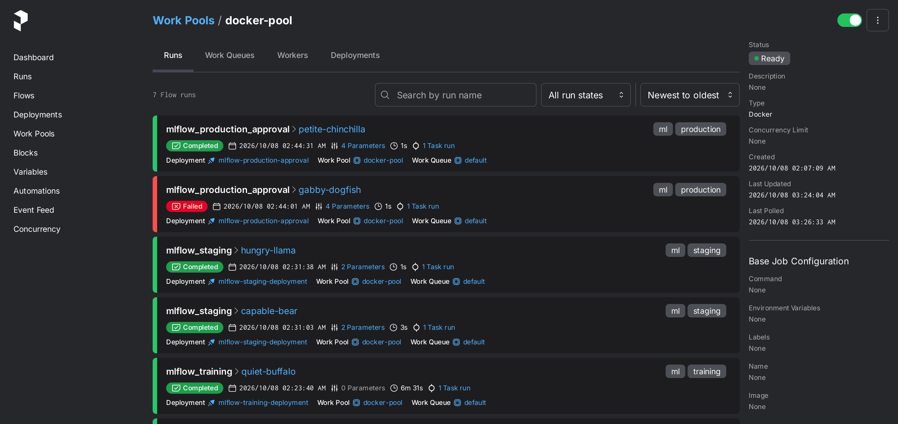
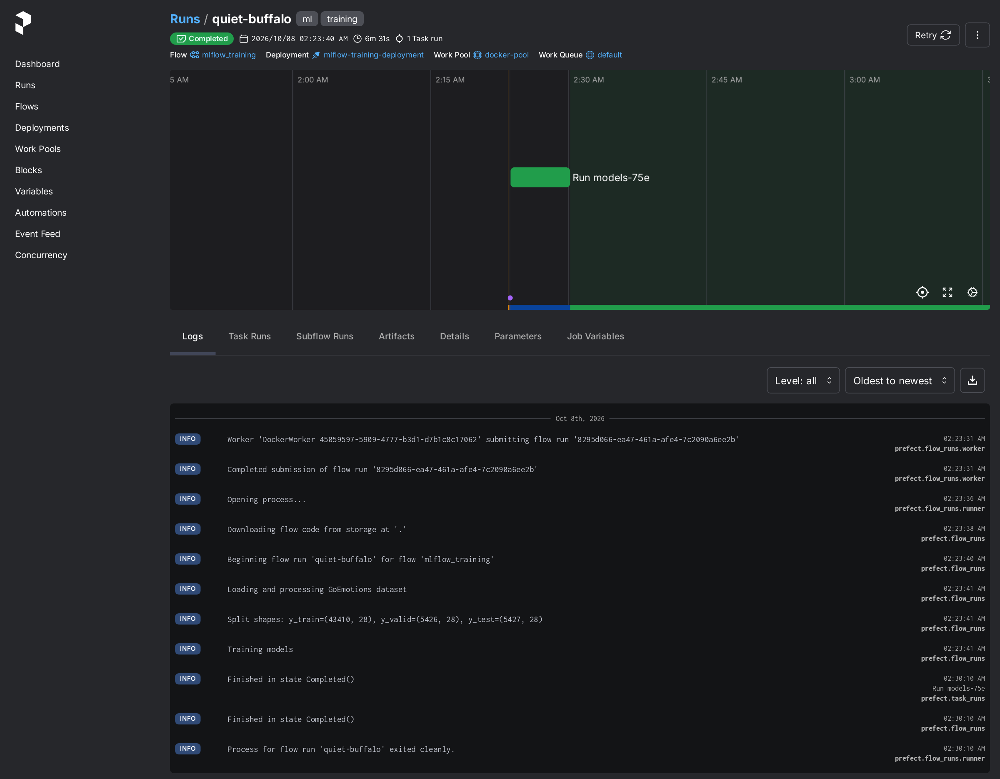
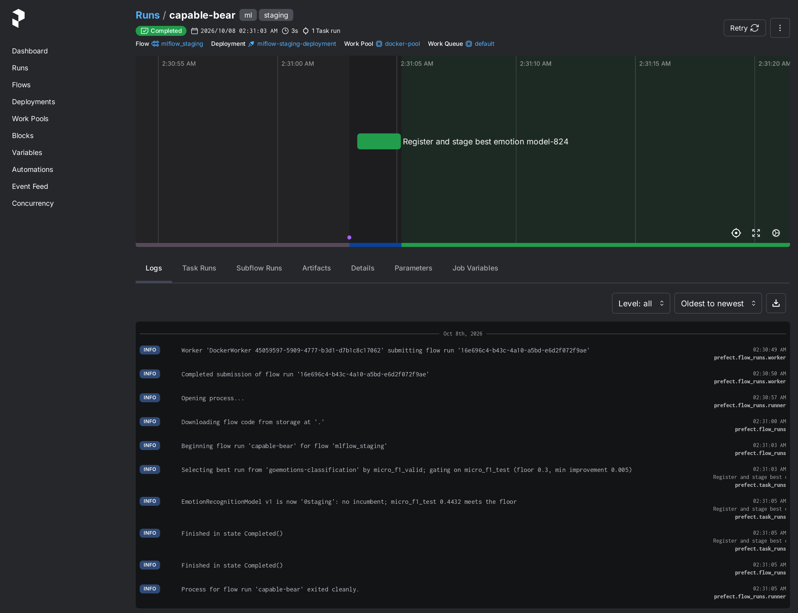
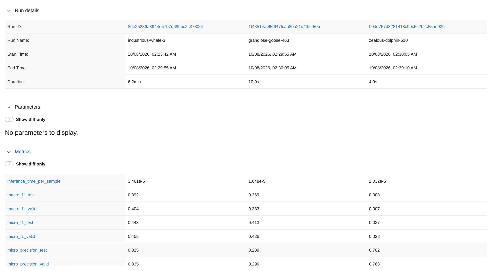
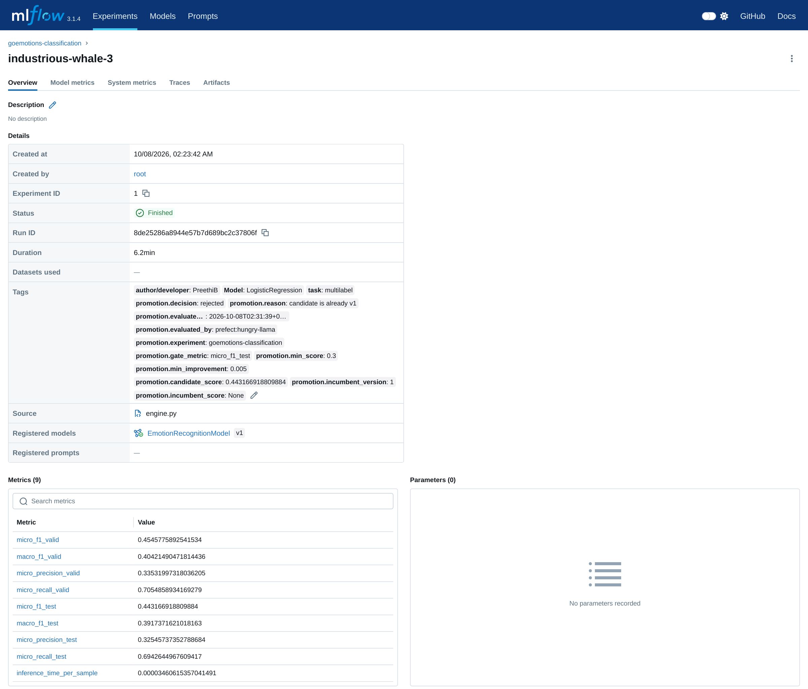
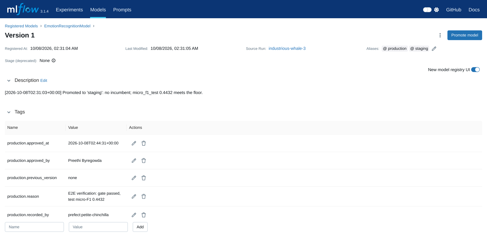
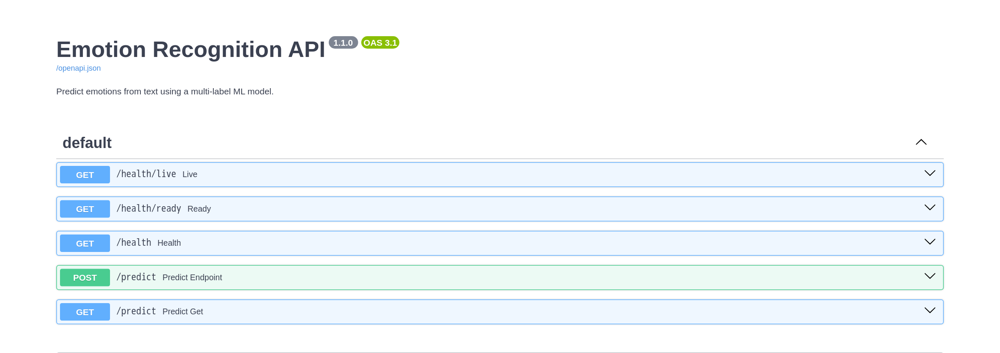
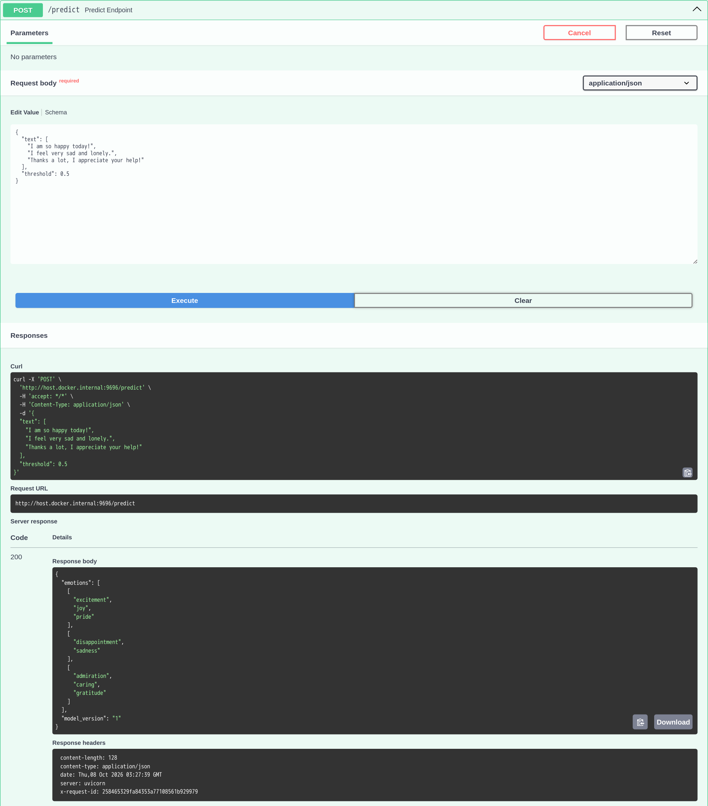

# MLOps Platform: Model Lifecycle, Deployment Safety & Reliability

An end-to-end MLOps reference platform for a multi-label NLP model. Prefect orchestrates training and promotion on a Docker work pool, MLflow tracks experiments and holds the model registry, an automated gate decides what reaches staging, a named human approval decides what reaches production, and a FastAPI service serves whichever version the registry alias points to, refreshing without restarts.

It runs on a single machine. The goal is not scale but sound engineering of the model lifecycle: reproducible runs, safe promotion, traceability from every prediction back to its training run, and a service that degrades gracefully. Every claim below was verified end to end; known gaps are listed under Limitations.

## 💡 Problem

ML teams lose time to manual orchestration, inconsistent experiment tracking and fragile deployments. The failure modes are concrete: a model is promoted because it looked better on the data it was tuned on, nobody can say which model produced a prediction or who released it, and a registry or deployment hiccup takes the prediction service down.

This project addresses those failure modes with automation and explicit safety checks around a real model: emotion classification on [GoEmotions](https://huggingface.co/datasets/go_emotions) (Reddit comments labelled with 27 emotions plus *neutral*; about 16% carry more than one label, so it is multi-label end to end).

| Split | Examples |
|---|---|
| train | 43,410 |
| validation | 5,426 |
| test | 5,427 |

## 🏗️ Architecture

<p align="center">
  
</p>

1. **Training.** Prefect runs the `mlflow_training` flow (`main.py`) in a container on the `docker-pool` work pool. It trains three TF-IDF + one-vs-rest candidates and logs validation and test metrics plus the fitted pipeline to MLflow.
2. **Promotion.** The `mlflow_staging` flow (`stage.py`) picks the best run on validation data, then judges it on held-out test data against the current `@staging` model. Only a clear improvement is registered and promoted. A separate, manually triggered flow (`approve.py`) moves a staging version to `@production` with a named approver and reason.
3. **Inference.** The FastAPI container serves the registry version behind its configured alias (`@staging` by default, `@production` in a production deployment), re-checks the alias every minute and swaps in new versions without a restart.

The diagram source is [`images/architecture.svg`](images/architecture.svg); [`docs/README.md`](docs/README.md) explains how to regenerate the PNG.

## 🔐 Model lifecycle and deployment safety

**Selection and acceptance use different data.** Validation scores choose the candidate; held-out test scores decide whether it may replace the current model. The same numbers never do both.

**Promotion gate** (`stage.py`). The best finished run by `micro_f1_valid` is the only candidate; there is no fallback to the next run. It is promoted to `@staging` only if every rule holds, otherwise it is rejected (fail closed):

| Rule | Default |
|---|---|
| Candidate has a test score (`GATE_METRIC`) | `micro_f1_test` |
| Test score is at least `MIN_GATE_SCORE` | 0.30 |
| No incumbent, or the candidate beats the incumbent's test score by at least `MIN_IMPROVEMENT` | 0.005 |
| The incumbent has a test score to compare against | |
| The candidate is not already the incumbent | |

Each evaluation writes `promotion.*` tags (decision, reason, UTC time, actor, thresholds, candidate and incumbent scores) to the candidate run, and an approved candidate's new model version carries the same record. Run tags hold the most recent evaluation of that run; version tags hold the decision that created the version; every evaluation is also in the Prefect flow-run logs.

**Production approval** (`approve.py`). A Prefect flow, deployed but never scheduled, that moves `@production`. It requires `version`, `approved_by` and `reason`, accepts only the current `@staging` version (or, with `rollback=true`, an earlier version the gate approved), and records approver, reason, time and the previous production version as `production.*` tags.

**Serving reliability** (`web_service/`).
- Loads the alias's **exact version** (`models:/Name/<version>`), smoke-tests it, then swaps it in atomically; on any failure the previous model keeps serving.
- Startup never blocks on MLflow. With the registry down the service is live but not ready, `/predict` returns 503, and it recovers by itself. Registry calls are bounded to seconds instead of MLflow's multi-minute default retries.
- `GET /health/live` (process up) and `GET /health/ready` (validated model loaded; 503 with the last error otherwise). `GET /health` is an alias of readiness, used by the Docker `HEALTHCHECK`.
- Batches of up to 64 texts of at most 2,000 characters; anything else returns 422. Successful predictions include `model_version`.
- JSON logs: one event per request (request ID, status, duration, batch size, model version) and per model load or failed refresh. `X-Request-ID` is propagated or generated; a 500 returns the request ID, never internal error text.

## ⚙️ Engineering decisions

Each significant decision has an Architecture Decision Record in [`docs/adr/`](docs/adr/README.md) with context, consequences and rejected alternatives.

- **Prefect over Airflow.** Prefect 3 runs these flows on a Docker work pool with one server and one worker, far less to operate than an Airflow scheduler, webserver and executor for a handful of flows. The trade-off is a smaller ecosystem, acceptable when operational simplicity matters more than breadth.
- **MLflow tracking plus registry aliases.** One tool for runs, metrics, artifacts and versioned models that integrates with plain Python. Aliases (`@staging`, `@production`) replace MLflow's deprecated stages, so promotion is a registry operation and needs no code change in the service.
- **Fail-closed promotion with an audit trail.** A missing metric or unclear comparison rejects rather than guesses, and decisions are queryable in MLflow ([ADR 0004](docs/adr/0004-promotion-gate-and-production-approval.md)).
- **FastAPI for inference.** Typed request validation (the input limits are declared, not hand-checked) and generated OpenAPI docs. Developer experience and time to first prediction were prioritised over raw throughput.
- **Graceful degradation over fail-fast.** A registry outage leaves the service live and serving its last good model instead of crash-looping every replica ([ADR 0005](docs/adr/0005-inference-reliability.md)).
- **Docker for consistency.** The same images run locally and on the work pool. The training image is built from an allowlist, so local files never leak into it.
- **Supported, pinned runtime.** Python 3.12 with exact pins, including the web and database stack under Prefect and MLflow, after a relock showed unpinned upgrades break both ([ADR 0003](docs/adr/0003-python-3-12-runtime.md)).
- **Continuous integration.** GitHub Actions runs lint, lockfile checks, both test suites and both image builds on every push ([ADR 0002](docs/adr/0002-continuous-integration.md)).

## 📊 Verified results

Training on the full splits inside the Docker work-pool container (Python 3.12), labels assigned at the default 0.5 threshold:

| Candidate | micro-F1 valid | macro-F1 valid | micro-F1 test | macro-F1 test | micro-precision test | micro-recall test |
|---|---|---|---|---|---|---|
| **Logistic Regression** (promoted) | **0.455** | **0.404** | **0.443** | **0.392** | 0.326 | 0.694 |
| SGD (log loss) | 0.426 | 0.383 | 0.413 | 0.369 | 0.289 | 0.726 |
| Multinomial NB | 0.028 | 0.007 | 0.027 | 0.008 | 0.702 | 0.014 |

These are TF-IDF baselines. Balanced class weights favour recall over precision at the default threshold, which has not been tuned. Multinomial NB without class weighting almost never crosses 0.5 on rare labels and is far below the gate's floor.

What the end-to-end runs verified (WSL2 + Docker Desktop, fresh MLflow and Prefect stores):
- **Orchestration:** training, promotion and approval ran as Prefect deployments in work-pool containers built from the local image; artifacts uploaded through MLflow's proxy.
- **Gate:** the first evaluation promoted Logistic Regression as v1 ("no incumbent; micro_f1_test 0.4432 meets the floor"); re-running it rejected the same candidate ("candidate is already v1") and created no new version.
- **Approval:** a request with a blank reason failed and changed nothing; a valid one set `@production` and recorded the approver and reason.
- **Serving:** the container served `@staging` and `@production`. With MLflow stopped it was live in about 3 s, not ready, and returned 503 for predictions; 3 s after MLflow returned it served v1 and Docker reported it healthy, with no restart. Moving the alias to another version and back was picked up in 4 s each way. 65 texts, a 2,001-character text and an empty batch returned 422; 64 texts returned 200.
- **Data and upgrade:** `utils/generate_csv.py` reproduces the exact CSVs used; moving from Python 3.9 to 3.12 reproduced identical validation metrics.

## 🖥️ Screenshots

Captured with a headless browser from the current implementation, using the stores of the verified run above.

**Prefect: Docker work pool.** The five most recent flow runs: training, two promotion-gate evaluations (promote, then reject the re-run) and two production approvals. The failed run is real: an approval correctly refused because its reason was blank.



**Prefect: training run.** Runs in a work-pool container; the log shows the 28-label train, validation and test targets.



**Prefect: promotion gate run.** The gate's thresholds and its decision with the reason.



**MLflow: candidate comparison.** Validation and test scores for the three candidates.



**MLflow: promoted run.** Metrics for both splits, the gate tags, and the link to registered version 1. The run tags show the gate's most recent evaluation of this run, a re-run rejected because it was already v1; the decision that promoted it is recorded on the model version.



**MLflow: registered version.** Version 1 behind `@staging` and `@production`, the gate's decision in the description, and the production approval record (approver, reason, time, previous version).



**FastAPI: endpoints and a prediction.** Liveness and readiness probes, and a batch prediction that reports the serving model version.





## 🚀 Running it

Verified on WSL2 + Docker Desktop (Docker 28.4) with Python 3.12 and the locked versions: Prefect 3.4.11, prefect-docker 0.6.6, MLflow 3.1.4, scikit-learn 1.3.2, numpy 1.26.4, FastAPI 0.116.1 (inference).

**1. Install and fetch data**
```bash
make setup                           # pipeline env + inference env (web_service/)
pipenv run python utils/generate_csv.py   # downloads GoEmotions into data/
```

**2. Start MLflow and Prefect** (separate terminals)
```bash
pipenv run mlflow server --backend-store-uri sqlite:///mlflow.db \
  --artifacts-destination ./mlartifacts --host 0.0.0.0 --port 5000
pipenv run prefect server start --host 0.0.0.0 --port 4200      # UI at http://localhost:4200
```
`--artifacts-destination` makes MLflow proxy artifacts, which containers need; `--host 0.0.0.0` makes both reachable from containers.

**3. Train, gate and approve on the Docker work pool**
```bash
export PREFECT_API_URL=http://127.0.0.1:4200/api
docker build -t preethibyregowda/mlops-platform:latest .
pipenv run prefect work-pool create docker-pool --type docker
pipenv run python deployments.py                       # registers the three deployments
pipenv run prefect worker start --pool docker-pool     # separate terminal, same PREFECT_API_URL

pipenv run prefect deployment run 'mlflow_training/mlflow-training-deployment'
pipenv run prefect deployment run 'mlflow_staging/mlflow-staging-deployment'
pipenv run prefect deployment run 'mlflow_production_approval/mlflow-production-approval' \
  --param version=1 --param approved_by="Your Name" --param reason="Reviewed gate metrics"
```
Containers reach the host as `host.docker.internal`. Rebuild the image after changing flow code. The flows can also run without Docker (`pipenv run python main.py`, `stage.py`, or `approve.py --version 1 --approved_by "Your Name" --reason "..."`) with `MLFLOW_TRACKING_URI=http://127.0.0.1:5000`.

**4. Serve and query**
```bash
cd web_service
make run_webservice     # builds the image, starts it on :9696, waits for readiness, runs client.py
curl http://127.0.0.1:9696/health/ready
curl -X POST http://127.0.0.1:9696/predict -H 'content-type: application/json' \
  -d '{"text": ["I am so happy today!", "I feel very sad and lonely."]}'
make stop_webservice
```
The container serves `@staging` from `http://host.docker.internal:5000` by default; set `MODEL_ALIAS=production` for a production deployment. Swagger UI: http://127.0.0.1:9696/docs

**Configuration** (environment variables)

| Variable | Default | Used by |
|---|---|---|
| `MLFLOW_TRACKING_URI` | `http://localhost:5000` | all |
| `MLFLOW_EXPERIMENT_NAME` | `goemotions-classification` | training, promotion |
| `MODEL_NAME` | `EmotionRecognitionModel` | promotion, approval, API |
| `MODEL_ALIAS` | `staging` | promotion target; alias the API serves |
| `PRODUCTION_ALIAS` | `production` | approval |
| `SELECTION_METRIC` / `GATE_METRIC` | `micro_f1_valid` / `micro_f1_test` | promotion |
| `MIN_GATE_SCORE` / `MIN_IMPROVEMENT` | `0.30` / `0.005` | promotion |
| `MODEL_REFRESH_SECONDS` | `60` (0 disables) | API |
| `MAX_BATCH_SIZE` / `MAX_TEXT_LENGTH` | `64` / `2000` | API |
| `LOG_LEVEL` | `INFO` | API |

## 🧪 Tests and CI

`make lint` (ruff) and `make test` (47 tests, each suite in its own locked environment):
- **Pipeline (24):** label parsing; the promotion gate against a real temporary MLflow store, covering selection by validation only, every rejection rule and the audit tags; production approval and rollback rules.
- **Inference (23):** predictions, input limits, liveness vs readiness, starting with the registry down and recovering, swapping versions without restart, keeping the old model when a new one fails, non-blocking startup, request IDs and log fields.

CI (`.github/workflows/ci.yml`) runs lint, `pipenv verify` for both lockfiles, both suites, and builds both images with an import check inside each. Its commands were reproduced locally from a clean checkout; the workflow has not yet run on GitHub.

## ⚠️ Limitations

- **Single host, Docker Desktop networking.** Verified only on WSL2 + Docker Desktop. On native Linux Docker the API container needs `--add-host=host.docker.internal:host-gateway` or another `MLFLOW_TRACKING_URI`. Not tested.
- **No authentication.** MLflow and Prefect bind to `0.0.0.0` without auth; the approver is a typed name, not an authenticated identity. The service loads pickled models, so anyone who can write to the registry can run code in it. Use only on a trusted machine.
- **Local storage.** SQLite and a local artifact directory; no backups or concurrency guarantees.
- **Gate assumptions.** Test scores are computed at training time against a fixed test set that every promotion reuses. A registry whose current model predates the gate has no test score, so the gate rejects every candidate until that model is retrained. Run-level audit tags keep only the latest evaluation of a run.
- **Serving.** Each gunicorn worker polls the registry on its own (one worker today); two models are in memory during a swap; nothing alerts if refreshes stop.
- **Model quality.** TF-IDF baselines with an untuned threshold.
- **Dependencies.** The pinned server stack must be upgraded together with Prefect and MLflow; scikit-learn 1.3.2 emits a SciPy deprecation warning that a future SciPy could turn into an error.
- **Images are large:** about 2.1 GB for training (MLflow server, Prefect, Hugging Face `datasets`) and 1.1 GB for inference.

## 🔮 Roadmap (not implemented)

- One-command stack (`docker compose`) with Postgres and object storage for MLflow, and an end-to-end CI job on it.
- Observability: Prometheus metrics, alerting on failed refreshes and errors, OpenTelemetry tracing, model and data drift detection.
- Kubernetes deployment for horizontal scaling of the inference service.
- Scheduled retraining through the existing gate; threshold tuning; a statistical test instead of a fixed improvement margin.
- Dependency automation (Dependabot or Renovate) and container scanning; scikit-learn and numpy 2 upgrade.

## 📂 Project structure
```
.
├── main.py                   # Training flow: candidates, validation + test metrics
├── stage.py                  # Promotion gate flow and audit record
├── approve.py                # Production approval flow
├── deployments.py            # Prefect 3 deployments on the Docker work pool
├── Dockerfile                # Work-pool image (allowlist in .dockerignore)
├── tests/                    # Pipeline tests
├── utils/generate_csv.py     # Downloads GoEmotions to data/
├── docs/adr/                 # Architecture Decision Records
├── LICENSE                   # MIT (scope in the License section)
├── .github/workflows/ci.yml  # CI
└── web_service/
    ├── app/main.py           # FastAPI app: probes, limits, request logging
    ├── emotion_model/        # Model store (refresh), predictions, JSON logging
    ├── tests/                # Inference tests
    ├── Dockerfile            # Inference image with HEALTHCHECK
    └── client.py             # Example HTTP client
```

## 🙏 Acknowledgements

This project began from [PatrickCmd/mlops-project](https://github.com/PatrickCmd/mlops-project), Patrick's August 2022 capstone for the [MLOps Zoomcamp](https://github.com/DataTalksClub/mlops-zoomcamp) by [DataTalks.Club](https://datatalks.club/), which predicted Capital Bikeshare ride durations with Prefect 2, MLflow and a Flask service. Its layout (separate training and staging scripts, a `web_service/` directory, Makefile and Pipenv) was the starting point. The code here was written for this project, and this repository was created fresh, without that project's history. Only generic boilerplate (Pipenv-generated headers, standard imports, common `.gitignore` entries) matches the original. The original repository does not publish a license.

## 📄 License

[MIT](LICENSE), covering the code and documentation written for this project. It does not grant rights to third-party material: the original project above, the [GoEmotions](https://huggingface.co/datasets/go_emotions) dataset (downloaded at setup, not included here), or the user interfaces of MLflow, Prefect and Swagger UI shown in the screenshots.
